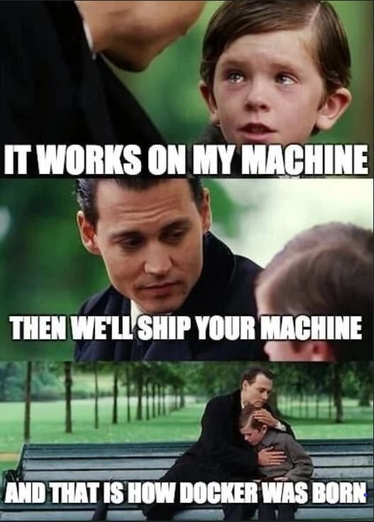

# Docker - Best Practices and Tips for P361

presented by Tanmoy + Clemens on 2021-06-04



## Agenda

* Docker basic usage
    * 00 docker help
    * 10 docker run
        * flags
            * `-it`
            * `--rm`
        * volumes
        * ports
        * env
    * docker ps
* Using Docker images
    * docker build
        * Dockerfile syntax 
    * docker login
    * docker tag
    * docker push
    * docker pull
    
## Resources

* To run these examples you need a bash prompt on a host where docker is installed.
* https://docs.docker.com/
* https://docs.docker.com/reference/

## Docker commands

We are not going to tell you the full story here.  The general (simplified) form of a docker command line is:
```shell
docker command [...]
```

## Docker help, docker version

If all else fails, try reading the documentation:
* https://docs.docker.com/
* https://docs.docker.com/reference/

### docker help

A list of the many docker commands is printed when you run docker without any arguments.
Or take a look at the left column on https://docs.docker.com/engine/reference/commandline/cli/ .
```shell
docker
docker help
docker --help
```
Get built-in help messages from docker. 

### docker help help
```shell
docker help help
docker --help help
docker help --help
```
Get some help about a specific command. In the example: help about `help`.

### docker version
```shell
docker --version
```
Concise version information on a single line.

```shell
docker version
```
Extensive version information.

## Docker run

```shell
$ docker run
"docker run" requires at least 1 argument.
See 'docker run --help'.

Usage:  docker run [OPTIONS] IMAGE [COMMAND] [ARG...]

Run a command in a new container
```
We will address the parts of the `docker run` command line one by one.

```shell
docker run --help
```
Long list of all available options and flags, with short explanations.

### Docker run: options and flags

#### Interactive versus detached usage

##### Interactive mode: `-it`

This is the usual combination when you want to interact through the terminal with a program running inside a docker container.

```shell
  -i, --interactive                    Keep STDIN open even if not attached
  -t, --tty                            Allocate a pseudo-TTY
```

**Example:** The `busybox` docker image provides simple versions of many standard linux tools. By default, it opens a `sh` shell:
```shell
$ docker run -it busybox
/ # echo $0
sh
/ # ls
bin   dev   etc   home  proc  root  sys   tmp   usr   var
/ # cd 
~ # pwd
/root
~ # ls
~ # id
uid=0(root) gid=0(root) groups=10(wheel)
~ # 
```

##### Detached mode: `-d`

Use detached mode to run a container in the background. You can still interact with it by other means.
```shell
  -d, --detach                         Run container in background and print container ID
```

#### Port mapping: `-p`

```shell
```

#### Cleanup

```shell
      --rm                             Automatically remove the container when it exits
```


```shell
docker run -it busybox sh -c 'echo hello; sleep 10; echo goodbye'
```


```shell

```


```shell

```


```shell

```


```shell

```


```shell

```


### Docker run: image


### Docker run: command and args


### initial plan by Tanmoy and Clemens

* (TODO can we find that book online somewhere?)
* TODO maybe a good example? https://github.com/docker-library/hello-world

* Goal of the presentation
  prerequisities: 
  1. Some theory on the basics why is docker required, its advantages
  2. some basic concepts
    * architecture of docker
    * docker run
    * the command line
    * the CMD and ENTRYPOINT
    * what do the "-it" flags mean
    * volumes, bind mount
    * networking
        * ports       
        * IP adresses
    * environment variables
    * docker registry
  best practices
    * getting help
        * docker help
        * docker docu on web

  3. Hands on to
     3.1. create a docker image for yourself
        * Dockerfile syntax 
        * registry, image name, and tagging
        * uploading to ECR
        * downloading to ECR
     3.2. Launch the docker and play around - some exercises
     3.3. docker-compose
       graphite grafana
  exercises: 
  1. create an image take an existing one from dockerhub and 
  4. Briefly touch upon the different docker images available in p361 and their contents 
     
    quiz in the end - kahoot


* basic usage

 

## Docker on Windows

* everybody can install it before the training

## Docker on AWS

* fallback, same environment for everybody

## Docker command line


## Docker registry

* local
* docker hub
* AWS ECR

## Docker in PyCharm

## Docker compose

## Creating docker images


## flags
```
clemens.groepl@M-C02XV1J6JHD3 am-poc-agtt % docker

Usage:  docker [OPTIONS] COMMAND

A self-sufficient runtime for containers

...
...
...

Run 'docker COMMAND --help' for more information on a command.

To get more help with docker, check out our guides at https://docs.docker.com/go/guides/
```

## Questions


